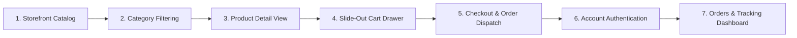
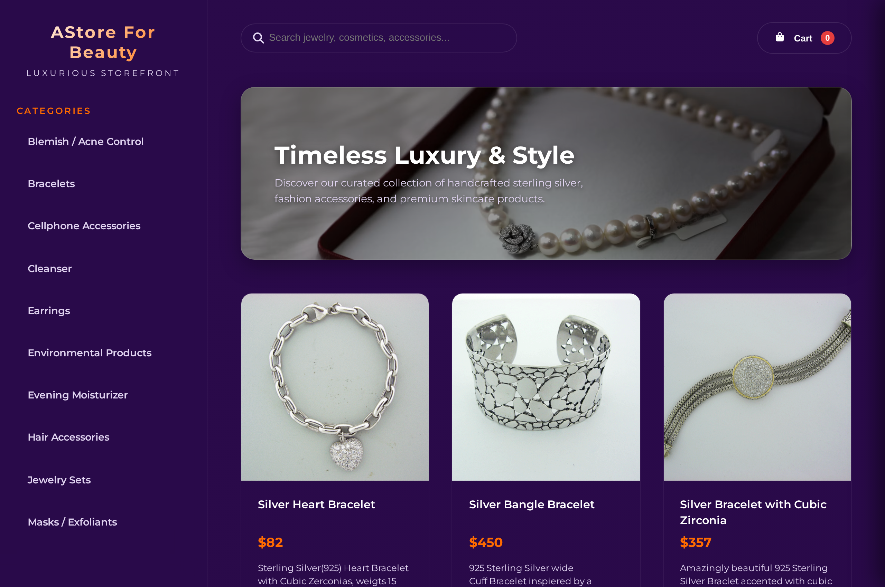
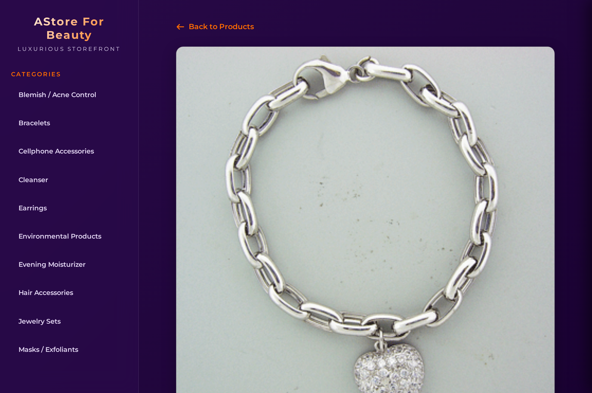
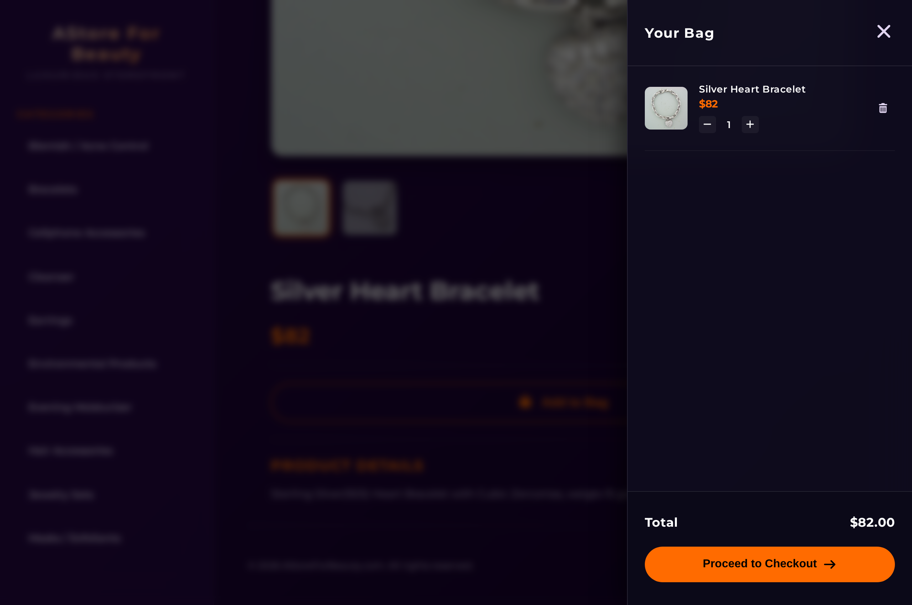
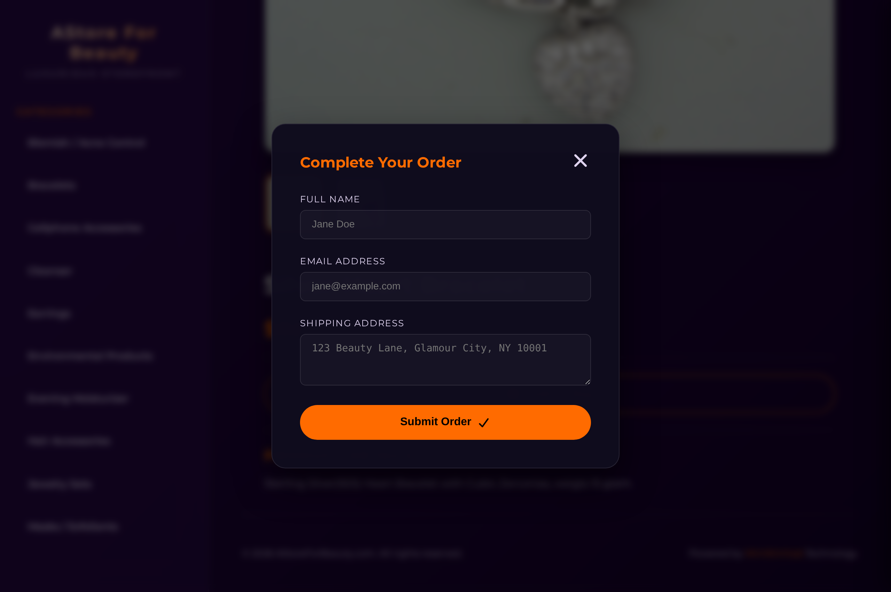
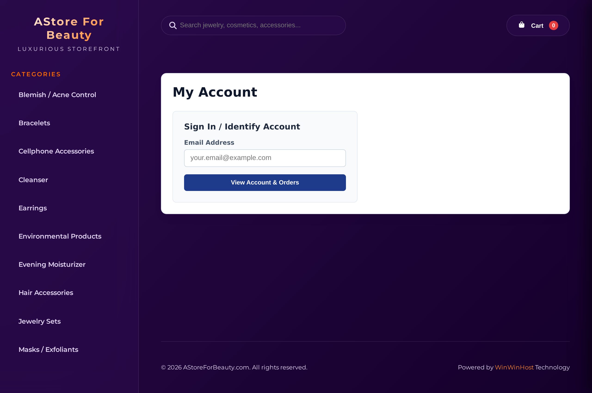

# Angular Shop: End-to-End Storefront UX Flow & Architectural Dossier

> ⚠️ **ARCHITECTURAL ARCHIVE & MIGRATION NOTICE**  
> `astoreforbeauty.com` and `astore4beauty.com` have transitioned to **Native React MVC Architecture** within [`multiDomainCMS`](file:///home/robert/projects/multipleDomainCMS) (`src/views/astoreforbeauty.com/` and `src/routes/domains/astoreforbeauty.com.ts`).  
> This dossier preserves the authentic user experience, component hierarchy, data models, and visual states of the historical Angular 18 single-page storefront.

---

## Executive Summary & Milestone Overview

The Angular Shop storefront was engineered as a high-performance, single-page e-commerce application utilizing **Angular 18 (`@angular-devkit/build-angular:application`)**, **TailwindCSS**, and **`ChangeDetectionStrategy.OnPush`**. The customer journey spans 7 core milestones:

---

## UX Flow Milestones & Visual State Captures

### Milestone 1: Storefront Landing & Luxury Product Grid
* **Route**: `/` (or `/#/`)
* **Component**: `ProductListComponent` (`src/app/product-list/product-list.component.ts`)
* **Key Capabilities**:
  - Hero promotional banner with direct CTA to featured collections.
  - Category pill filter navigation.
  - Multi-column responsive product card grid with hover zoom, quick-pricing badges, and direct "Add to Cart" triggers.

---

### Milestone 2: Category-Filtered Catalog Navigation
* **Route**: `/category/:id` (e.g. `/category/4` or `/category/bracelets`)
* **Component**: `ProductListComponent` with route parameter subscription
* **Key Capabilities**:
  - Filtered catalog view scoped dynamically to parent-child taxonomy groupings.
  - Dynamic result counter and active category state pills.
  - Client-side filtering via `ConfigService.getConfig()`.

---

### Milestone 3: Standalone Product Detail Page (PDP)
* **Route**: `/product/:id` (or `/product/:slug`)
* **Component**: `ProductDetailsComponent` (`src/app/product-details/product-details.component.ts`)
* **Key Capabilities**:
  - High-resolution product hero gallery.
  - Price display with currency formatting and inventory indicators.
  - Full product narrative, SKU specifications, and delivery estimates.
  - Quantity selector and instant "Add to Bag" primary action.

---

### Milestone 4: Slide-Out Cart Drawer
* **Component**: `CartComponent` / `AppComponent` Drawer Overlay
* **Key Capabilities**:
  - Non-blocking slide-out drawer providing immediate visual feedback upon item addition.
  - Line-item quantity controls, thumbnail previews, and item removal.
  - Dynamic subtotal, tax estimation, and prominent "Proceed to Checkout" CTA.

---

### Milestone 5: Checkout Modal & Order Dispatch
* **Route / Modal**: Direct overlay triggered from Cart
* **Component**: Checkout modal within `CartComponent`
* **Key Capabilities**:
  - Comprehensive customer shipping address inputs (Name, Email, Street, City, State, ZIP).
  - Payment method selection (Credit Card / PayPal integration placeholders).
  - Form validation with structured POST payload dispatch to `/api/order`.

---

### Milestone 6: Customer Account & Sign-In Entry
* **Route**: `/account`
* **Component**: `AccountComponent` (`src/app/account/account.component.ts`)
* **Key Capabilities**:
  - Clean unauthenticated sign-in view prompting for email address.
  - Seamless lookup against `users_backend` microservice.
  - Session persistence in local browser storage (`user_email`).

---

### Milestone 7: Authenticated Orders & Fulfillment Tracking Dashboard
* **Route**: `/account` (authenticated state)
* **Component**: `AccountComponent` with active order history binding
* **Key Capabilities**:
  - Historical order listing retrieved via `GET /api/user/account?email=...`.
  - Order status badges (`Delivered`, `Shipped`, `Processing`).
  - Itemized breakdown with product titles, quantities, timestamps, and order totals.

---

## Technical Component Architecture & Route Map

| UX Milestone | Angular Component | Route | Key Services / APIs |
| :--- | :--- | :--- | :--- |
| **Catalog Landing** | `ProductListComponent` | `/` | `ConfigService` (`/assets/config.json`) |
| **Category View** | `ProductListComponent` | `/category/:id` | `ActivatedRoute` params |
| **Product Detail** | `ProductDetailsComponent` | `/product/:id` | `ConfigService`, `CartService` |
| **Cart Drawer** | `AppComponent` / `CartComponent` | Global Overlay | `CartService` |
| **Checkout Modal** | `CartComponent` | Modal Trigger | `HttpClient.post('/api/order')` |
| **Account Login** | `AccountComponent` | `/account` | `LocalStorage`, `HttpClient` |
| **Orders Dashboard** | `AccountComponent` | `/account` | `HttpClient.get('/api/user/account')` |

---

## Parity & Transition Matrix: Angular to React MVC

All capabilities documented above have been ported and enhanced in the `multiDomainCMS` native React MVC engine:

| Feature / UX Element | Angular Implementation | MultiDomainCMS React MVC Implementation |
| :--- | :--- | :--- |
| **Storefront Layout** | `app.component.html` + `product-list` | `src/views/astoreforbeauty.com/layout.tsx` |
| **Product Catalog Grid** | `product-list.component.html` | `src/views/astoreforbeauty.com/pages/ShopPage.tsx` |
| **Product Detail (PDP)** | `product-details.component.html` | `src/views/astoreforbeauty.com/pages/ProductDetailPage.tsx` |
| **Cart Drawer** | `cart.component.html` | `src/views/astoreforbeauty.com/components/CartDrawer.tsx` |
| **Checkout Modal** | `cart.component.html` (modal section) | `src/views/astoreforbeauty.com/components/CheckoutModal.tsx` |
| **Account & Orders** | `account.component.html` | `src/views/astoreforbeauty.com/pages/AccountPage.tsx` |
| **Promo Code Engine** | *Not present in Angular* | `src/views/astoreforbeauty.com/components/ClientScripts.tsx` |
| **Verified Reviews** | *Not present in Angular* | `src/views/astoreforbeauty.com/components/ProductReviews.tsx` |
| **Beauty Bundle Cross-Sell** | *Not present in Angular* | `src/views/astoreforbeauty.com/components/BeautyBundle.tsx` |
